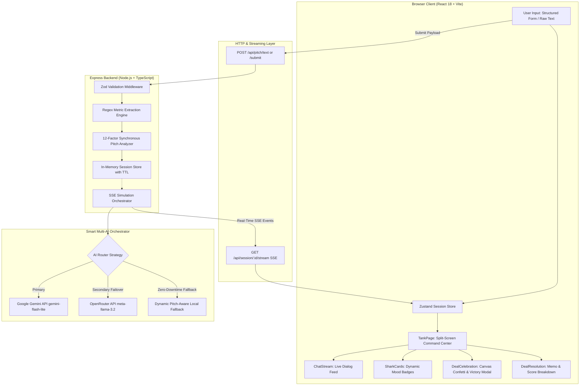
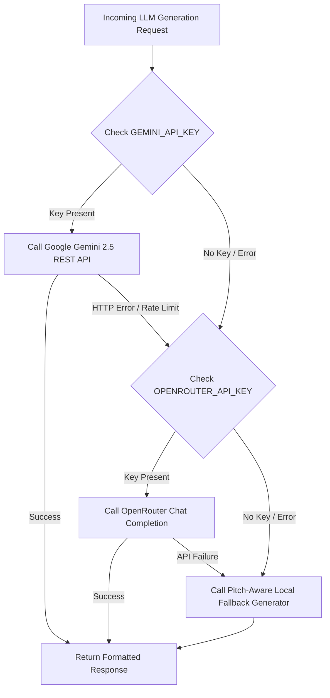

# 🏛 Shark Tank Simulator — System Architecture & Technical Design

---

## 1. Executive System Overview

**Shark Tank Simulator** is an event-driven, full-stack web application designed for real-time simulation of institutional venture capital pitch sessions. The system operates on a dual-runtime monorepo model:
- **Frontend Client:** React 18, Vite, TypeScript, Tailwind CSS, Zustand, and an HTML5 Canvas particle physics engine.
- **Backend API & Orchestration Engine:** Node.js, Express, TypeScript, Zod, Server-Sent Events (SSE), and a multi-provider AI routing architecture.

---

## 2. Monorepo Structure

```
shark-tank-simulator/
├── client/                               # Frontend Single Page Application
│   ├── src/
│   │   ├── components/
│   │   │   ├── ChatStream.tsx            # Live chat message feed with typing indicators
│   │   │   ├── DealCelebration.tsx       # HTML5 Canvas confetti explosion & victory modal
│   │   │   ├── DealResolution.tsx        # Comprehensive score breakdown & investment memo
│   │   │   ├── Footer.tsx                # Slim, accessible footer bar
│   │   │   ├── Navbar.tsx                # Brand header with navigation links
│   │   │   ├── PhaseIndicator.tsx        # 4-stage simulation progress bar
│   │   │   ├── SharkCard.tsx             # Active speaker card with real-time mood badges
│   │   │   ├── StructuredPitchForm.tsx   # 4-step wizard covering all 12 evaluation factors
│   │   │   └── TextPitchForm.tsx         # Free-form pitch text / business plan paste input
│   │   ├── hooks/
│   │   │   └── useSessionStream.ts       # SSE EventSource listener dispatching to Zustand
│   │   ├── pages/
│   │   │   ├── HomePage.tsx              # Landing page, value proposition, and shark lineup
│   │   │   ├── PitchPage.tsx             # Mode-switching pitch submission interface
│   │   │   └── TankPage.tsx              # Split-screen command center for live pitch stream
│   │   ├── services/api.ts               # REST API client & SSE stream connection helper
│   │   ├── stores/sessionStore.ts        # Zustand reactive state store
│   │   └── types/                        # Client-side domain types & constants
│   ├── index.html                        # Application entry HTML
│   ├── tailwind.config.js                # Custom design tokens, gradients, animations
│   ├── tsconfig.json                     # Client TypeScript configuration (baseUrl, paths)
│   └── vite.config.ts                    # Vite build configuration with /api reverse proxy
│
├── server/                               # Backend API & Simulation Engine
│   ├── src/
│   │   ├── config/
│   │   │   ├── index.ts                  # Centralized env validation
│   │   │   └── sharks.ts                 # Personas, system prompts, focus areas, factor weights
│   │   ├── middleware/
│   │   │   ├── errorHandler.ts           # Centralized HTTP & runtime error handler
│   │   │   └── validation.ts             # Zod input schemas for structured & text pitches
│   │   ├── routes/
│   │   │   ├── pitch.ts                  # Ingestion endpoints & regex metric extraction engine
│   │   │   └── session.ts                # SSE stream orchestrator (/api/session/:id/stream)
│   │   ├── services/
│   │   │   ├── aiRouter.ts               # Multi-provider router (Gemini 2.5, OpenRouter, fallback)
│   │   │   ├── openai.ts                 # Phase-aware prompting, offer generation, final memo
│   │   │   ├── pitchAnalyzer.ts          # Synchronous 12-factor analytical scoring engine
│   │   │   └── sessionStore.ts           # In-memory session repository with 2-hour TTL cleanup
│   │   ├── types/index.ts                # Shared server domain interfaces & data types
│   │   └── index.ts                      # Express app initialization, Helmet, CORS, rate limits
│   ├── .env                              # Environment variable definitions
│   └── tsconfig.json                     # Server TypeScript configuration (NodeNext, baseUrl)
│
├── demopitch/                            # Pre-configured test pitch files
│   ├── deal_pitches.txt                  # 10 guaranteed deal-winning pitches
│   └── no_deal_pitches.txt               # 10 guaranteed rejection pitches
│
├── ARCHITECTURE.md                       # This document
├── REPORT.md                             # Project sprint log & engineering report
├── README.md                             # User guide, setup, and overview
└── package.json                          # Workspace root package configuration
```

---

## 3. High-Level Architecture Diagram



---

## 4. Simulation Lifecycle: 4-Phase State Machine

When a session stream is initiated via `GET /api/session/:id/stream`, the backend orchestrates four distinct conversation phases:

```mermaid
sequenceDiagram
    autonumber
    actor Founder as Pitcher / Client
    participant SSE as Express SSE Stream
    participant Analyzer as Pitch Analyzer
    participant Router as Smart AI Router
    participant Sharks as Shark Personas

    Founder->>SSE: Connects to /api/session/:id/stream
    SSE->>Analyzer: Runs 12-factor analytical scoring
    Analyzer-->>SSE: Returns initial score profile & strengths/weaknesses

    rect rgb(20, 30, 45)
        Note over SSE,Sharks: Phase 1: Initial Analysis
        SSE->>Founder: event: phase_change { phase: 'analysis' }
        loop For each Shark (Vikram, Alya, Kabir, Devika)
            SSE->>Router: Prompt with pitch data & specialty focus
            Router-->>SSE: Generated shark reaction & mood
            SSE->>Founder: event: shark_message
        end
    end

    rect rgb(30, 35, 20)
        Note over SSE,Sharks: Phase 2: Grilling Questions
        SSE->>Founder: event: phase_change { phase: 'questions' }
        loop For each Shark
            SSE->>Router: Prompt to challenge weakest metric or assumption
            Router-->>SSE: Generated piercing follow-up question
            SSE->>Founder: event: shark_message
        end
    end

    rect rgb(45, 30, 20)
        Note over SSE,Sharks: Phase 3: Negotiation & Offers
        SSE->>Founder: event: phase_change { phase: 'negotiation' }
        loop For each Shark
            SSE->>Router: State interest & make aggressive counter-offer
            Router-->>SSE: Generated counter-terms (amount, equity %, condition)
            SSE->>Founder: event: shark_message & event: deal_offer
        end
    end

    rect rgb(20, 45, 30)
        Note over SSE,Sharks: Phase 4: Final Verdict & Resolution
        SSE->>Founder: event: phase_change { phase: 'decision' }
        loop For each Shark
            SSE->>Router: Render final binary verdict ("I AM IN" vs "I AM OUT")
            Router-->>SSE: Final decision text
            SSE->>Founder: event: shark_message
        end
        SSE->>Router: Generate Investment Memo & Business Review JSON
        Router-->>SSE: Executive memo & 12-factor rating breakdown
        SSE->>Founder: event: session_complete { finalDeal }
    end

    opt Pitcher Wins a Deal
        Founder->>Founder: Triggers DealCelebration Canvas Confetti & Victory Banner
    end
```



---

## 5. Metric Extraction Engine (`extractPitchMetrics`)

When a user pastes unstructured pitch text into `POST /api/pitch/text`, the backend runs high-efficiency pattern extraction to identify key metrics without pre-LLM latency:

```typescript
// Extracted Metrics Structure
interface ExtractedMetrics {
  margin: number | null;       // e.g., "Gross Margin 85%" -> 85
  cac: number | null;          // e.g., "CAC $800" -> 800
  ltv: number | null;          // e.g., "LTV $12,000" -> 12000
  mrr: number | null;          // e.g., "MRR $125k" -> 125000
  runway: number | null;       // e.g., "Runway 24 months" -> 24
  burnRate: number | null;     // e.g., "Burn $30k/mo" -> 30000
  revenue: number | null;      // e.g., "$1.5M ARR" -> 1500000
  founderNames: string;        // e.g., "Sarah Jenkins (ex-NSA...)"
  moat: string;                // e.g., "Proprietary telemetry network..."
  traction: string;            // e.g., "300 enterprise clients, 18% MoM..."
}
```

These extracted values immediately populate the `StartupPitch` entity, ensuring the synchronous `pitchAnalyzer` and the downstream AI system prompts evaluate accurate financial figures.

---

## 6. AI Routing & Failover Architecture

To ensure 100% platform availability and avoid single-provider rate limiting or quota exhaustion, `aiRouter.ts` implements a multi-tier fallback hierarchy:



---

## 7. API Specification

| Method | Endpoint | Description | Request Payload | Response |
|--------|----------|-------------|-----------------|----------|
| `GET` | `/health` | Health probe | None | `{ status: "ok", timestamp }` |
| `POST` | `/api/pitch/submit` | Structured form intake | `PitchSchema` (12 factors) | `{ sessionId, pitchId, analyses, overallScore }` |
| `POST` | `/api/pitch/text` | Free-text intake | `{ pitchText, companyName, askAmount, equityOffered }` | `{ sessionId, pitchId, message }` |
| `GET` | `/api/pitch/session/:id` | Session summary | None | `SessionState` JSON |
| `GET` | `/api/session/:id` | Full session detail | None | `SessionState` JSON |
| `GET` | `/api/session/:id/stream` | Live SSE stream | None | SSE Stream (`text/event-stream`) |

### SSE Event Types
- `phase_change`: `{ phase: "analysis" | "questions" | "negotiation" | "decision" }`
- `shark_message`: `SharkMessage` (`id`, `sharkId`, `sharkName`, `content`, `mood`, `phase`, `offer?`)
- `deal_offer`: `{ sharkId, offer: DealOffer }`
- `session_complete`: `{ sessionId, finalDeal: FinalDeal }`
- `error`: `{ message: string }`

---

## 8. 12-Factor Institutional Weighting Model

$$\text{Overall Score} = \sum_{i=1}^{12} (\text{Factor Score}_i \times \text{Weight}_i)$$

| Pillar | Key | Weight | Scoring Criteria |
|---|---|---|---|
| **Problem** | `problem` | **10%** | Pain urgency, frequency, and market impact |
| **Market Size** | `marketSize` | **12%** | TAM > $10B receives maximum rating |
| **Product / Solution** | `solution` | **10%** | Technical differentiation & feasibility |
| **Traction** | `traction` | **12%** | MoM revenue growth rate and retention |
| **Business Model** | `businessModel` | **8%** | Recurring SaaS, high take rates, pricing power |
| **Unit Economics** | `unitEconomics` | **12%** | LTV/CAC ≥ 3x, Gross Margin ≥ 50%, Payback < 12mo |
| **Competition** | `competition` | **8%** | Realistic competitive matrix positioning |
| **Competitive Moat** | `moat` | **10%** | Proprietary IP, data network effects, switching costs |
| **Founding Team** | `team` | **10%** | Domain pedigree, technical depth, executive background |
| **Scalability** | `scalability` | **8%** | Low marginal cost of customer expansion |
| **Financials** | `financials` | **5%** | Sustainable runway (≥18 months) and burn efficiency |
| **Exit Potential** | `exitPotential` | **5%** | Identified strategic buyers (e.g., Cisco, John Deere) |

---

## 9. Security & Production Hardening

- **Helmet:** Enforces secure HTTP response headers.
- **CORS:** Restricts cross-origin requests to configured client origin (`http://localhost:5173`).
- **Rate Limiting:** Prevents API spamming with `express-rate-limit` (30 requests/minute per IP).
- **Zod Schema Validation:** Enforces strict typing and bounds on all incoming JSON payloads before controller execution.
- **TypeScript Integrity:** Both server and client compile cleanly with zero TypeScript errors under strict type checking.
