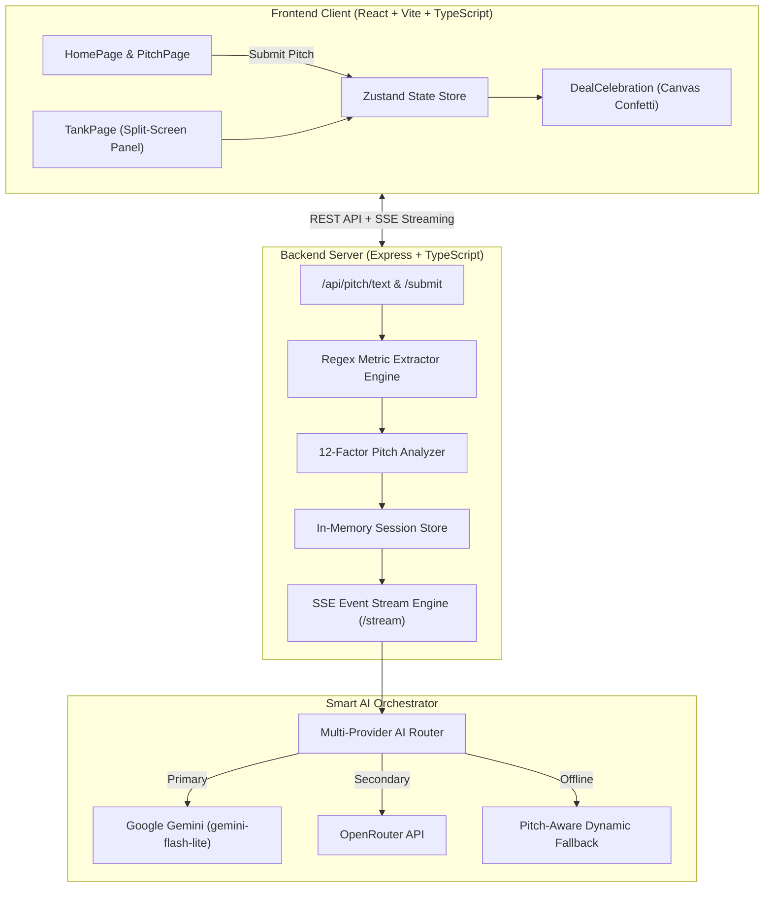

<div align="center">

# 🦈 Shark Tank Simulator
### **An Institutional-Grade AI Startup Pitch & Scrutiny Platform**

[](file:///d:/shwet/code/Shark-Tank-Simulator)
[](file:///d:/shwet/code/Shark-Tank-Simulator)
[](file:///d:/shwet/code/Shark-Tank-Simulator)
[-brightgreen?style=for-the-badge)](file:///d:/shwet/code/Shark-Tank-Simulator)

*Subject your startup to authentic, unfiltered investor scrutiny before stepping in front of real venture capitalists.*

</div>

---

## 🎯 Overview & Mission

Most early-stage founders fall victim to the **"Polite Feedback Echo Chamber"**—friends, family, and colleagues nod along, but real venture investors scrutinize unit economics, customer acquisition costs, gross margins, and defensible moats.

**Shark Tank Simulator** puts you face-to-face with a panel of four specialized autonomous AI Sharks. The panel rigorously stress-tests your business across 12 institutional investment criteria, questions weak assumptions, makes counter-offers, and renders authentic investment verdicts in real time.

---

## ✨ Key Features

- **4 Specialized Shark Personas**:
  - 🦅 **Vikram "The Hawk" Malhotra** — *Unit Economics Enforcer* (CAC, LTV, Gross Margins, Burn Rate, Runway).
  - 🎯 **Alya Sharma** — *Brand & Moat Strategist* (Proprietary IP, Network Effects, Defensibility).
  - 🌍 **Kabir Mehta** — *Global Market Strategist* (TAM, Scalability, Multi-Billion Exit Potential).
  - 💼 **Devika Roy** — *Deal Architect & Valuation Hawk* (Team Credibility, Valuation Realism, Hard Bargains).
- **Dual Pitch Ingestion**:
  - **Structured 4-Step Wizard**: Comprehensive form covering market size, traction, financials, and unit economics.
  - **Free-Text Paste Mode**: Paste your raw pitch deck text, executive summary, or memo—our backend engine automatically parses metrics, ARR, margins, and moats.
- **Real-Time Live SSE Streaming**:
  - Watch the panel debate and react live across **4 distinct simulation phases** (*Initial Analysis*, *Deep Grilling Questions*, *Heated Negotiation*, and *Final Decision*).
- **Authentic Deal Closing & Counter-Offers**:
  - Real dynamic decisions: genuine evaluation produces genuine deals. Strong startups trigger shark bidding wars; overvalued or weak concepts get rejected with actionable feedback.
- **🎉 Interactive Deal Celebration**:
  - Founders who win a deal are greeted with an HTML5 Canvas confetti explosion, celebratory modal, and investment summary.
- **Institutional Investment Memo**:
  - Every session generates an institutional-grade investment memo, 12-factor score breakdown, and personalized improvement action items ready for text export.

---

## 🏗 System Architecture



---

## ⚡ Quick Start

### 1. Prerequisites
- **Node.js** v18+ 
- **npm** v9+

### 2. Installation
```bash
# Clone the repository
git clone https://github.com/shwet1808/Shark-Tank-Simulator.git
cd Shark-Tank-Simulator

# Install root dependencies
npm install

# Install server & client dependencies
cd server && npm install
cd ../client && npm install
cd ..
```

### 3. Environment Configuration

#### Server (`server/.env`)
```env
PORT=3000
NODE_ENV=development
PRIMARY_AI_PROVIDER=gemini

# API Keys — one or more is required for AI-powered responses.
# If none are set, the system falls back to pitch-aware dynamic responses.
GEMINI_API_KEY=your_gemini_key_here
OPENROUTER_API_KEY=your_openrouter_key_here
OPENAI_API_KEY=your_openai_key_here

# Model selection (used when the corresponding provider is active)
GEMINI_MODEL=gemini-2.0-flash
OPENROUTER_MODEL=google/gemini-2.5-flash

# CORS — set to your frontend's URL in production (e.g., https://your-app.vercel.app)
CORS_ORIGIN=http://localhost:5173
```

#### Client (`client/.env`)
```env
# Production: point this at your Render backend URL.
# Leave empty in dev — the Vite proxy forwards /api to localhost:3000.
VITE_API_BASE=
```

> See `server/.env.example` and `client/.env.example` for full details.

### 4. Running the Application
From the root directory:
```bash
# Run the app with the frontend served by the backend
npm run dev
```
- **Application URL:** [http://localhost:3000](http://localhost:3000)
- **Backend health check:** [http://localhost:3000/health](http://localhost:3000/health)

To run the client and API separately, start `npm run dev --workspace=server` and `npm run dev --workspace=client` in separate terminals. The client is then available at `http://localhost:5173` and proxies `/api` to port `3000`.

---

## 🚀 Deployment Guide

The app is designed for deployment as **two independent services**:

| Service | Platform | Build Command | Output Directory |
|---------|----------|---------------|-----------------|
| **Backend** | Render | `npm run build --workspace=server` | `server/dist/` |
| **Frontend** | Vercel | `npm run build --workspace=client` | `client/dist/` |

### Step 1: Deploy the Backend (Render)

1. Create a new **Web Service** on Render and connect your repo.
2. Set the **Build Command** to: `npm install && npm run build --workspace=server`
3. Set the **Start Command** to: `node server/dist/index.js`
4. Add these **Environment Variables** (Project Settings → Environment):

| Variable | Value |
|----------|-------|
| `PORT` | *(leave unset — Render assigns this automatically)* |
| `NODE_ENV` | `production` |
| `CORS_ORIGIN` | `https://your-app.vercel.app` |
| `PRIMARY_AI_PROVIDER` | `gemini` (or `openrouter` or `openai`) |
| `GEMINI_API_KEY` | `your-gemini-api-key` |
| `OPENROUTER_API_KEY` | `your-openrouter-key` *(optional backup)* |
| `OPENAI_API_KEY` | `your-openai-key` *(optional backup)* |

### Step 2: Deploy the Frontend (Vercel)

1. Create a new **Project** on Vercel and connect your repo.
2. Set the **Root Directory** to `client`.
3. Set the **Build Command** to: `npm install && npm run build`
4. Set the **Output Directory** to: `dist`
5. Add this **Environment Variable** (Project Settings → Environment Variables):

| Variable | Value | Example |
|----------|-------|---------|
| `VITE_API_BASE` | *Your Render backend URL (origin or `/api` URL)* | `https://shark-tank-api.onrender.com` |

### Step 3: Redeploy

After setting all variables, trigger a fresh deploy of **both** services. Vite embeds `VITE_API_BASE` into the frontend at build time, and the client appends `/api` when you provide only the backend origin. The Vite proxy is for local development only; it does not run on Vercel. `client/vercel.json` configures the SPA fallback so direct visits and refreshes on app routes work.

> **Troubleshooting**: Set `CORS_ORIGIN` on Render to the exact Vercel site origin (include `https://`, no path or trailing slash). For preview deployments, separate each allowed origin with a comma. Check `https://your-backend.onrender.com/health` to verify the backend is reachable. Redeploy the Vercel frontend after changing `VITE_API_BASE`.

---

## 🧪 Testing with Demo Pitches (`/demopitch`)

The `/demopitch` directory contains pre-configured test pitches:

| File | Purpose | Contents |
|------|---------|----------|
| [`demopitch/deal_pitches.txt`](file:///d:/shwet/code/Shark-Tank-Simulator/demopitch/deal_pitches.txt) | **10 Deal Pitches** | Strong LTV:CAC (≥3x), gross margins (≥50%), proven traction, and credible moats that win deals. |
| [`demopitch/no_deal_pitches.txt`](file:///d:/shwet/code/Shark-Tank-Simulator/demopitch/no_deal_pitches.txt) | **10 No-Deal Pitches** | Flawed economics, $0 revenue, absurd valuations, and nonexistent moats that get rejected. |

### How to Test in 30 Seconds:
1. Open [http://localhost:5173/pitch](http://localhost:5173/pitch).
2. Switch to the **"Paste Pitch Text"** tab.
3. Open `demopitch/deal_pitches.txt`, copy `[DEAL PITCH #1] — SentinelAI`, paste into the form, and click **"Enter the Tank"**.
4. Experience the live stream, watch sharks compete, and trigger the **🎉 Deal Celebration**!

---

## 📊 12-Factor Institutional Scorecard

Every startup is rigorously scored (1–10) across twelve institutional pillars:

| # | Pillar | Weight | Focus Area |
|---|--------|--------|------------|
| 1 | **Problem** | 10% | Pain severity, frequency, and market urgency |
| 2 | **Market Size** | 12% | Total Addressable Market (TAM) > $5B |
| 3 | **Product/Solution** | 10% | Differentiation, technical feasibility |
| 4 | **Traction** | 12% | MoM revenue growth, user velocity, retention |
| 5 | **Business Model** | 8% | Pricing power, recurring revenue structure |
| 6 | **Unit Economics** | 12% | LTV/CAC ratio, gross margins, payback period |
| 7 | **Competition** | 8% | Landscape awareness, positioning |
| 8 | **Competitive Moat** | 10% | IP, network effects, high switching costs |
| 9 | **Founding Team** | 10% | Domain pedigree, execution track record |
| 10 | **Scalability** | 8% | Operating leverage, capital efficiency |
| 11 | **Financials** | 5% | Runway, burn rate sustainability |
| 12 | **Exit Potential** | 5% | Clear M&A acquirers, IPO viability |

---

## 🛠 Technology Stack

- **Frontend**: React 18, Vite, TypeScript, Tailwind CSS, Lucide React, Zustand.
- **Backend**: Node.js, Express, TypeScript, Zod, Server-Sent Events (SSE), Helmet, CORS.
- **AI Infrastructure**: Google Gemini 2.5 (`gemini-flash-lite-latest`), OpenRouter API, custom smart fallback engine.
- **Code Standards**: Strict TypeScript (`tsc` 0 errors), modular component hierarchy.

---

<div align="center">
<b>Ready to face the Tank? Step inside and test your startup.</b>
</div>
